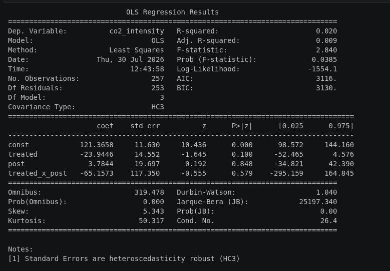
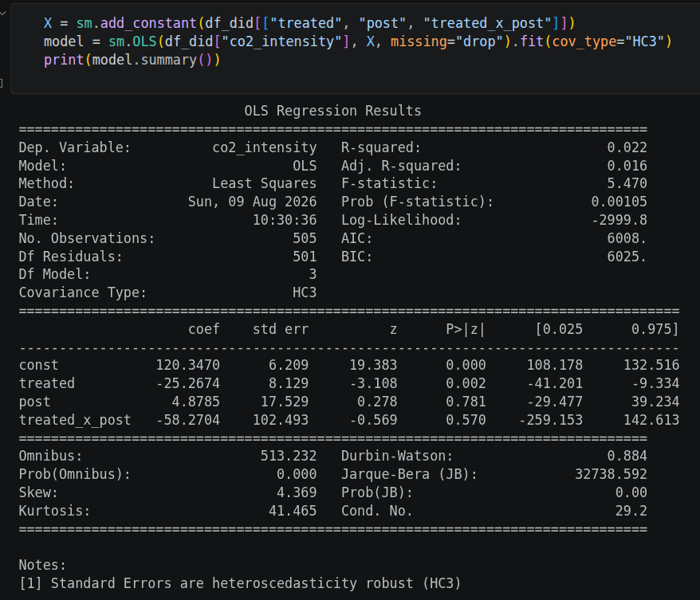
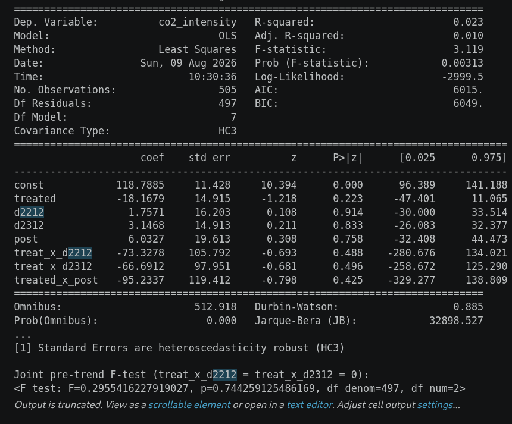

# Overview

The goal of this project is to analyze the influence of the USA's 2025 tariffs(that includes Liberation Day and June 2025 steel tariffs) on carbon footprint of supply chains for washing machines.
 
It will use Difference-in-Difference method, as well as the Carbon Rerouting index

# Data Cycle

## Obtaining the Data

Here is the data that I need for my project, with links to sources.

[Ember Energy](https://ember-energy.org/latest-insights/global-electricity-review-2025/major-countries-and-regions/) - main source for ton-km data.

[US Census Bureau: Port HS6 Imports](https://www.census.gov/foreign-trade/data/PORTHS6MM.html) - data on tonnage/value/origin/destination of imported goods. Contains information on ports of destination, but NOT the destionation states, which makes the project use this dataset for imports from Asian countries(China/South Korea/Vietnam)

[Country list](https://www.census.gov/foreign-trade/schedules/c/country.txt) - list of country codes that the Census Bureau uses in their data.

Office of the President. Executive Order 14326, "Further Modifying the Reciprocal Tariff Rates." Federal Register, vol. 90, no. 149, 6 Aug. 2025, pp. 37963–67, www.federalregister.gov/documents/2025/08/06/2025-15010/further-modifying-the-reciprocal-tariff-rates.
 - information for tariff rates on China, Vietnam, South Korea.

## Cleaning

As usual, cleaning the data will the the most time-consuming part here. For each of two periods(Dec 2024 and Dec 2025), there were two dataframes - one for land-based imports from Mexico(using the "State Imports HS6" dataset), another for naval imports from Asian countries(using the "Port HS6 Imports") dataset. 
+ Deduplicated columns
+ converted necessary columns to numbers

For now, the carbon footprint only includes CO2 emitted by one leg of transportation(port-to-port for Asian countries, land transportation for Mexico). This will be amended later on.

## Data Processing
I began with a simple 2x2 difference-in-difference model that involves only the land-based Mexico data, which is then run through a OLS regression. 

+ Time - pick the proper start and end time in order to see the change over time. Must address the seasonality component of demand
    + Before: Dec 2024
    + After: Dec 2025
+ Treatment group: washing machines
+ Control group: TV sets/monitors

As a result, there has been no change in CO2 emissions of the supply chain. 

## Statistics Analysis
A OLS model, with DiD estimator and HC3 covariance. R²=0 for all trials, regardless of improvements to the model. Given the full pass-through of tariffs(Flaen, et al.), this can be explained by high elasticity of demand.

The first attempt was using OLS model with the Difference-in-Differences coefficient. 
\begin{figure}
    \centering
    \includegraphics[width=0.5\linewidth]{first_run_statistic_overview.png}
    \caption{OLS Regression Results First Attempt}
    \label{fig:placeholder}
\end{figure}

Fig. 2 shows that there is no correlation between tariffs and CO2 of supply chains. However, the high kurtosis(421) and skew(19) values show problems in the data. 

First thing I did to address those problems is to create a long table, where the primary key consists of country of origin, date(Dec 2024 vs Dec 2025) and product(TV vs washing machine). Then I weighted the average distance. This should account more accurately for how much in weight has been carried over each route. Thus, kurtosis changed to 210 and skew changed to 7.
However, there remained one key problem - one of units. The base CO2 unit was too prone to skewness and kurtosis(why is this bad?). I fixed this by changing the unit to CO2 intensity, which is more normalized. Now, the kurtosis and skewness are both much smaller, but R² remained 0. 
Must apply more additions(i.e. dose treatment) to be certain, but this does point out that America's 2025 tariffs did little to significantly redirect the trade routes of washing machines. 

One plausible explanation for this is that for importers, the elasticity of demand is low enough that even with high tariffs, they'd rather keep importing from same sources than change their trade routes. 

Then I converted the dependent variable from CO2 to CO2 intensity, which is total CO2 in grams divided over total weight of goods imported in kilograms. Also I fixed a unit mismatch.
\begin{figure}
    \centering
    \includegraphics[width=0.5\linewidth]{fourth-improvement.png}
    \caption{OLS Regression Results 2nd Attempt}
    \label{fig:placeholder}
\end{figure}

Added the dose version. Omnibus increased from 3 to 8, while Prob(omnibus) decreased tenfold to 0/017. Skew slightly increased to 0.478, kurtosis decreased to 1.32.

\begin{figure}
    \centering
    \includegraphics[width=0.5\linewidth]{another-trial.png}
    \caption{Enter Caption}
    \label{fig:placeholder}
\end{figure}

Fig. 4 - Fourth revision of the experiment. Mexico's data has been integrated into the port dataset, since port codes also describe land ports. The skew and kurtosis have increased significantly after that. Still R²=0

Fig. 5 - fifth revision of the experiment. Mexico's data has been dropped due to tariffs being negligible.

Fig 6 - pre-trend analysis. It shows that treated and untreated were already diverging before the tariffs.